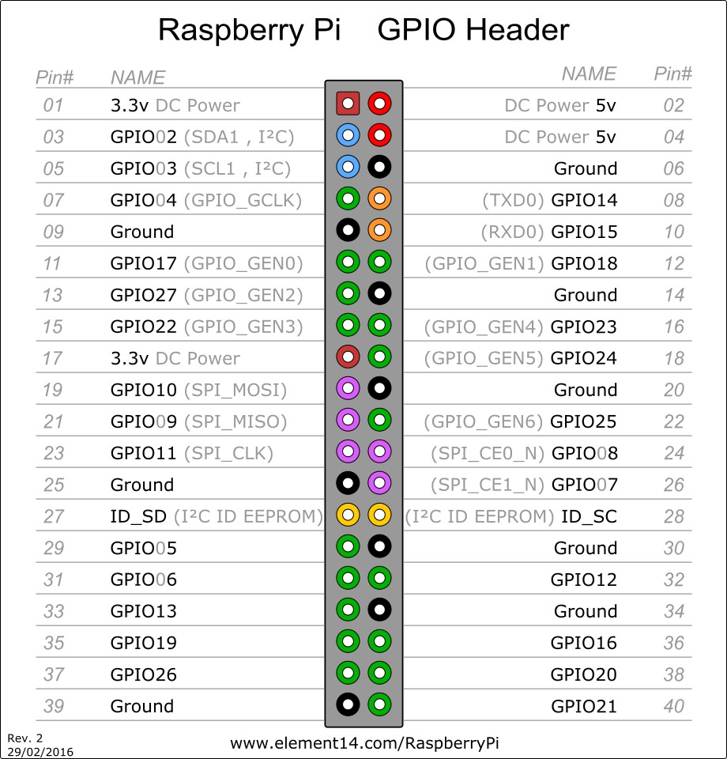
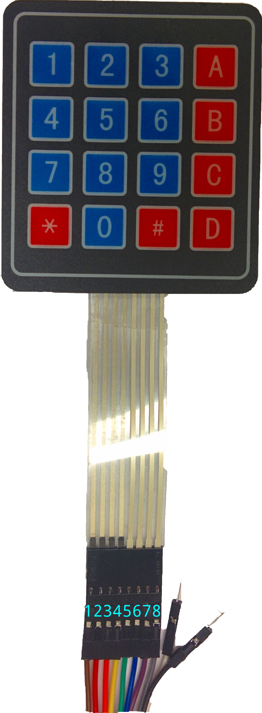
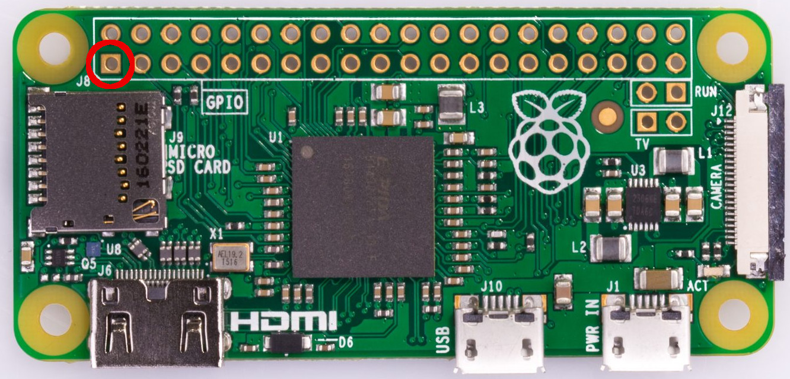

## 1. Objectifs

Ce travail pratique vise les objectifs suivants :

1. Apprendre le fonctionnement d'un pilote dans Linux;
2. S'initier à la programmation en mode noyau (kernel);
3. Acquérir les connaissances nécessaires à l'interfaçage d'un périphérique simple;
4. Se familiariser avec les classes de dispositifs de caractères et à l'utilisation du sous-système de fichier /dev;
5. Apprendre à utiliser judicieusement les interruptions dans un système embarqué.

> **IMPORTANT : l'archive des sources Linux téléchargée lors du laboratoire 1 est incomplète. Lisez et effectuez les actions de la section 3.1 _avant toute chose_.**

## 2. Préparation et outils nécessaires (matériel)

Ce laboratoire est quelque peu différent des précédents, puisque vous devrez utiliser du matériel supplémentaire, en l'occurrence le petit clavier externe à 16 touches que vous avez déjà utilisé dans le cours *Systèmes microprocesseur et interfaces*. Pour ceux n'ayant pas suivi le cours *Systèmes microprocesseur et interfaces*, vous pouvez vous procurer le claviers au magasin de département de génie électrique et de génie informatique. Pensez aussi à avoir le filage (ex. jumpers) pour faire la connexion aux RPi.

Ce clavier est très rudimentaire et vous devrez concevoir la logique nécessaire à sa lecture. Il possède *huit* fils d'entrée/sortie : 4 connexions pour les lignes et 4 pour les colonnes. Ces sorties seront connectées aux *GPIO* (*General Purpose Input-Output*) de votre Raspberry Pi Zero. Ce dernier possède 40 points (pins) de connexion, agencés selon le schéma suivant (source : [element14](https://www.element14.com/community/docs/DOC-73950/l/raspberry-pi-3-model-b-gpio-40-pin-block-pinout)) :

 

Vous observerez que sur votre Raspberry Pi Zero, une seule de ces broches possède un contact carré. C'est cette broche qui constitue la broche #1 et vous permet d'orienter le schéma présenté ci-dessus. En d'autres termes, la broche #1 est celle encerclée en rouge dans l'image suivante :



Vous devriez avoir des connecteurs déjà soudés sur les broches de votre Raspberry Pi. Si ce n'est pas le cas, vous pouvez le faire faire au service technique pour une somme modique.

Comme vous pouvez le constater, toutes les broches ne sont pas équivalentes. Certaines peuvent cumuler plusieurs fonctions alors que d'autres sont simplement des références pour la masse (Ground) ou des sources de tension. Dans le cadre de ce laboratoire, nous vous suggérons de brancher les *lignes* du clavier (qui seront écrites par le Raspberry Pi) sur les broches 29, 31, 33 et 35. De même, les *colonnes* du clavier (qui seront lues) devraient être branchées aux broches 32, 36, 38 et 40. D'autres configurations peuvent fonctionner et vous êtes libre de les utiliser, mais celle que nous vous proposons fonctionne à coup sûr. Si vous utilisez le clavier à 16 touches du cours de SMI, le schéma présenté ci-dessus, à droite, peut vous aider à vous repérer. Dans ce schéma, les fils sont numérotés de gauche à droite. Le fil **1** est connecté à la première *ligne* (la plus haute) du clavier, le **2** à la seconde, et ainsi de suite. Le fil **5** est connecté à la première *colonne* (celle de *gauche*) du clavier, le fil **6** à la seconde et ainsi de suite.

**Attention lors des connexions** : les broches de sortie du Raspberry Pi sont des interfaces très rudimentaires et, en particulier, elles ne possèdent pas vraiment de systèmes de protection en cas de mauvais branchement. Brancher par exemple une ligne sous tension à une broche reliée à masse (*ground*) court-circuitera à coup sûr votre Raspberry Pi! Assurez-vous toujours que vos branchements sont corrects et qu'il n'y a pas de faux contacts avant de mettre l'ordinateur sous tension! Par ailleurs, nous vous *recommandons fortement* de ne pas changer les connexions alors que le Raspberry Pi est sous tension!

## 3. Préparation et outils nécessaires (logiciels)

Les ébauches de code sont disponibles sur le dépôt Git suivant : [https://github.com/setr-ulaval/labo4-h23](https://github.com/setr-ulaval/labo4-h23). Vous y retrouvez, comme pour les autres laboratoires, un projet VScode et deux fichiers source correspondant aux deux pilotes que vous devrez implémenter. Notez que la configuration qui vous est fournie assume que vous avez bâti votre environnement de compilation croisée en suivant à la lettre les instructions du laboratoire 1. Si vous obtenez des erreurs liées à des en-têtes manquants, vérifiez que vous avez bien utilisé les sources du noyau correspondant à la version présente sur le Raspberry Pi. Pour cette même raison, vous ne devez *pas* avoir mis à jour le noyau installé sur votre Raspberry Pi.

La compilation et l'édition de liens d'un module noyau constituent probablement une des tâches les plus délicates pour un environnement de compilation croisée. Pour cette raison, le noyau Linux possède son propre système de compilation, basé sur *Make*; nous n'utiliserons donc pas CMake dans le cadre de ce laboratoire.

### 3.1. Téléchargement du noyau
Compiler un module noyau requiert d'avoir une version compilé du noyau sur votre machine hôte. Vous pouvez télécharger l'archive [suivante](http://wcours.gel.ulaval.ca/2020/h/GIF3004/default/linux-rpi-4.19.y-rt.2.tar.gz) dans le dossier `$HOME/rPi` de la VM ou de votre ordinateur. Assurez vous de retirer le dossier `linux-rpi-4.19.y-rt` s'il est présent avant de décompressé l'archive. Si vous souhaitez installer le noyau dans un autre dossier, assurez vous de modifier la ligne 5 du `Makefile` du projet avec votre propre chemin.

> Note : il se peut que la colorisation syntaxique indique des erreurs dans la directive _include_ de linux/kthread.h. Ce n'est pas un problème tant que vous pouvez tout de même compiler vos programmes sans erreur ni avertissement.

### 3.2. Procédure de compilation

Contrairement à l'habitude, n'utilisez pas la commande `CMake : Build` pour compiler votre projet. Allez plutôt dans la palette de commandes et écrivez « Tâches: Exécuter la tâche », puis sélectionnez *Compilation*. Le raccourci clavier `Ctrl + Shift + B` peut également être utilisé sur la plupart des configurations. Si tout se passe correctement, les fichiers `setr_driver_irq.ko` et `setr_driver_polling.ko` devraient apparaître dans votre répertoire de travail. Ce sont ces fichiers qui constituent les modules noyau.

> Notez que tout comme pour les laboratoires précédents, vos fichiers doivent non seulement compiler sans erreur, mais aussi **sans avertissement** de la part du compilateur!


### 3.3. Insertion des modules et débogage

Une fois vos modules compilés sans erreur, transférez les sur votre Raspberry Pi en utilisant la tâche `toutSynchroniser`, comme au laboratoire précédent. Cela copiera les fichiers .ko dans le répertoire `~/projects/laboratoire4` de votre Raspberry Pi.

> N'oubliez pas d'écrire l'adresse de votre Raspberry Pi dans le fichier `syncFiles.sh`!

Par la suite, ouvrez un terminal SSH sur le Raspberry Pi et allez dans le répertoire contenant les fichiers *.ko*. Vous pouvez maintenant tenter d'insérer chaque module (un à la fois) dans le noyau en utilisant *sudo insmod nom_du_fichier.ko*. Si tout se passe bien, la commande retournera sans erreur et un *lsmod* confirmera la présence de votre module. Vous pouvez alors le tester!

Notez que comme l'exécution d'un module noyau se fait logiquement en mode privilégié, il est impossible de le lancer en utiliser gdb. C'est donc dire que *vous ne pouvez utiliser les outils de débogage de VScode comme dans les laboratoires précédents*. Vous pouvez utiliser *printk* et autres fonctions pour rapporter de l'information de débogage.

## 4. Énoncé

Le code de base et les fichiers *Makefile* nécessaires à la compilation des modules sont disponibles sur le dépôt Git suivant : [https://github.com/setr-ulaval/labo4-h23](https://github.com/setr-ulaval/labo4-h23).

### 4.1. Méthode de lecture du clavier

Il existe sur le marché plusieurs types de claviers. Les plus évolués, tel votre clavier d'ordinateur, possèdent un microcontrôleur leur permettant de communiquer avec l'ordinateur en utilisant un protocole haut niveau (par exemple l'USB ou le Bluetooth). Toutefois, certains claviers sont conceptuellement beaucoup plus simples et nécessitent plus de travail de la part de l'ordinateur. C'est le cas du petit clavier que vous avez en votre possession. Ce clavier possède seulement 8 fils pour 16 touches, il est donc aisé de constater qu'une association 1:1 entre les fils et les touches est impossible.

En fait, chaque fil est relié à une *ligne* ou à une *colonne* du clavier. Chaque touche permet quant à elle de mettre en contact une ligne et une colonne. Si on applique par exemple une tension sur la deuxième ligne, alors une pression de la touche *6*, mettant en contact la deuxième ligne et la troisième colonne, va faire apparaître cette tension sur la troisième colonne. Observer cette tension nous permet donc de dire si la touche *6* est pressée ou non. De même, si une tension est présente sur la troisième ligne et la touche *8* enfoncée, alors cette tension apparaîtra sur la seconde colonne.

On remarque immédiatement un problème potentiel : si on applique à la fois une tension sur la première et la seconde ligne, il devient impossible de différencier une pression de la touche *3* et de la touche *6*, puisque ces deux actions produisent le même résultat (une tension sur la troisième colonne). Par conséquent, notre pilote va devoir scanner les lignes, une par une, afin de déterminer précisément quelle touche est enfoncée. En d'autres termes, l'algorithme de lecture sera le suivant :

1. On applique une tension sur la première ligne.
2. On vérifie si une tension est apparue sur une des colonnes. Si oui, nous savons qu'une touche est pressée, à l'intersection de la ligne courante et de la colonne sur laquelle une tension a été détectée.
3. On passe à la seconde ligne et vérifie à nouveau si une tension apparaît sur une des colonnes.
4. Ainsi de suite, jusqu'à la dernière ligne, après quoi le cycle recommence.

### 4.2. Écriture d'un module : 1) Initialisation

La première tâche d'un module est de s'initialiser en créant les structures de données dont il a besoin. En particulier, n'oubliez pas qu'un module peut être appelé plusieurs fois simultanément, vous *devez* donc créer et initialiser des primitives de synchronisation tels des mutex pour assurer que ces traitements parallèles s'effectuent sans encombre.

### 4.3. Écriture d'un module : 2) Création de nœuds dans le système de fichiers

La plupart des modules noyau s'interfacent avec le reste du système en utilisant l'abstraction du système de fichiers (rappelez-vous : sous Unix, tout est un fichier!). Les modules créent ainsi un certain nombre de pseudo-fichiers qui peuvent être utilisés pour communiquer avec eux. Dans le cadre de ce laboratoire, nous vous demandons de créer *un pseudo-fichier* :

* **/dev/claviersetr**, un périphérique accessible en lecture seulement en mode *caractère*. Lorsqu'ouvert en lecture, ce fichier retourne les caractères saisis sur le clavier externe. Lorsqu'aucun caractère n'est disponible, il retourne simplement 0. Vous devez vous assurer de conserver *tous* les caractères qui n'ont pas encore été lus via ce fichier, même si ce fichier n'est pas lu pendant une longue période, dans la limite de la taille du tampon de votre module!

### 4.4. Écriture d'un module : 3) Accès aux GPIO

L'accès aux GPIO peut être un casse-tête sur des systèmes complexes tels que le Raspberry Pi. Heureusement, le noyau Linux fournit une couche d'abstraction pour leur utilisation, dont vous pouvez retrouver [la documentation ici](https://www.kernel.org/doc/Documentation/gpio/gpio-legacy.txt). Nous allons donc utiliser ces fonctions au lieu d'interagir directement avec le matériel. Notez que cette API est maintenant dépréciée au profit d'une nouvelle API plus moderne. Toutefois, dans le cadre du laboratoire, nous nous contenterons de l'API « historique » (*legacy*), qui est beaucoup plus simple à utiliser.

### 4.5. Écriture d'un module : 4) Lecture du clavier par « polling »

Comme première tâche, vous devrez compléter et tester le fichier *setr_driver.c*. Ce pilote fonctionne sur le principe du *polling* : un thread noyau est lancé et balaye constamment les lignes du clavier afin de déterminer si une nouvelle touche a été enfoncée. À la fin de chaque balayage, il se met en pause pour une courte période de temps afin d'éviter de monopoliser un processeur.

Complétez ce fichier et vérifiez son bon fonctionnement. En particulier, vérifiez si 1) votre système prend en compte l'appui d'une touche et 2) ne la prend en compte qu'une seule fois lorsqu'elle n'est pas relâchée. Prenez le temps de lire *tous* les commentaires contenus dans le fichier, ils contiennent des informations importantes qui pourront vous être très utile. Observez également comment la charge processeur varie selon la durée de temps de repos que le thread requiert après chaque itération. Que se passe-t-il si on supprime carrément cette pause?

### 4.6. Écriture d'un module : 5) Lecture du clavier par interruption

Le système de lecture conçu jusqu'à maintenant est relativement peu efficace, puisqu'il oblige le Raspberry Pi à lire *systématiquement* l'état du clavier, même si rien n'a changé. Une méthode plus efficace à cet égard serait de ne vérifier l'état du clavier *que lorsqu'un événement s'est produit*. Pour ce faire, nous allons créant un *second module* utilisant les *interruptions*. L'idée générale est la suivante :

1. Lorsqu'aucune touche n'est pressée, les *quatre lignes* sont mises sous tension. On comprend donc aisément qu'une pression sur une touche, quelle qu'elle soit, fera apparaître une tension sur une des colonnes.
2. Des *interruptions* sont liées à un changement de valeur sur les colonnes. Cette mise sous tension sera donc remarquée par le Raspberry Pi qui appellera notre fonction liée à l'interruption.
3. À ce moment, nous savons seulement qu'une touche a été pressée, mais nous ne savons pas *laquelle*. Pour la retrouver, il suffit d'utiliser la même approche que celle présentée plus haut.

Comme on peut le constater, l'algorithme de lecture reste le même. La différence majeure est plutôt que, cette fois, le système n'a pas besoin *d'activement* vérifier la pression d'une touche, mais compte sur une interruption pour le lui signaler, ce qui est bien plus efficace.

Pour implémenter cet algorithme, basez-vous sur le fichier *setr_driver_irq.c*. Ce pilote est très similaire au précédent, mais alloue aussi des interruptions sur les broches de lecture. Par ailleurs, il n'y a plus de *thread* noyau : à sa place, un *tasklet* doit être appelé après chaque interruption, interruption dont la durée doit être la plus courte possible. Ce tasklet doit effectuer la tâche qui était précédemment dévolue au thread noyau, à savoir balayer les lignes pour déterminer quelle touche a été pressée. Comme pour la tâche précédente, voyez le fichier en question et en particulier ses commentaires pour plus de détails.

### 4.7. Gestion des appuis multiples

Vous aurez remarqué que l'algorithme suggéré n'est pas exempt de problèmes. En particulier, si plusieurs touches sont pressées simultanément, il se peut que notre pilote « manque » des touches, ou voit au contraire des pressions « fantômes », qui n'existent pas réellement. Il existe plusieurs solutions, matérielles ou logicielles, pour régler ce problème, jusqu'à un certain point. Implémentez-en une qui supporte la pression simultanée *d'au moins deux (2) touches* et démontrez son efficacité. Notez bien que vous n'avez évidemment pas le droit de changer de clavier... Pour ceux qui veulent aller plus loin, serait-il possible de gérer la pression simultanée de trois touches?


### 4.8. Débogage et tests

Il est peu probable que vos modules fonctionnent parfaitement du premier coup, et ce même s'ils compilent sans erreur. Malheureusement, il existe peu de procédures de débogage simples dans le cadre d'un développement en espace noyau. Le plus simple reste encore d'utiliser des *printk* à intervalle régulier : vous pourrez ensuite les visualiser en temps réel en utilisant la commande *dmesg -Hw*. Faites attention de ne pas *trop* imprimer de messages de débogage cependant; saturer le noyau de chaînes de caractères risque fort de poser problème!

Il peut arriver que votre module soit entré dans un état invalide et qu'il ne soit plus possible de le retirer, même en utilisant *rmmod* ou *modprobe -r*. Dans ces situations, la seule méthode permettant de revenir à un environnement correct est malheureusement de redémarrer le Raspberry Pi. Il en va de même pour les corruptions mémoire que votre module pourrait causer : n'oubliez pas qu'en espace noyau, les erreurs de segmentation n'existent pas et que ce n'est **pas** une bonne nouvelle pour vous! Écrire à des emplacements mémoires qui ne vous appartiennent pas peut résulter en toutes sortes de conséquences sur le reste du système...

Pour tester la sortie de votre périphérique (autrement dit, s'il renvoie bien les touches pressées, dans le bon ordre), vous pouvez utiliser la commande suivante :

```
sudo tail -f /dev/claviersetr ---disable-inotify
```

Cette commande lit votre pseudo-fichier à intervalle régulier (à chaque seconde par défaut) et afficher les nouveaux caractères au fur et à mesure. Notez que le paramètre *disable-inotify* doit bel et bien être précédé de *trois* tirets!

## 5. Modalités d'évaluation

Le laboratoire comporte deux livrables :

1. Module du pilote effectuant une lecture du clavier par « pooling » (fichier *setr_driver_polling.c*);
2. Module du pilote effectuant une lecture du clavier par interruption (fichier *setr_driver_irq.c*).

Ce travail doit être réalisé **en équipe de deux**, la charge de travail étant à répartir équitablement entre les deux membres de l'équipe. Aucun rapport n'est à remettre, mais vous devez soumettre votre code source dans monPortail avant le **30 mars 2023, 21h30**. Ensuite, lors de la séance de laboratoire du **31 mars 2023**, les deux équipiers doivent être en mesure individuellement d'expliquer leur approche et de démontrer le bon fonctionnement de l'ensemble de la solution de l'équipe du laboratoire. Si vous ne pouvez pas vous y présenter, contactez l'équipe pédagogique du cours dans les plus brefs délais afin de convenir d'une date d'évaluation alternative. Ce travail compte pour **15%** de la note totale du cours. Comme pour les travaux précédents, votre code doit compiler **sans avertissements** de la part de GCC.

Notre évaluation comprendra notamment les éléments suivants:
  1. L'exécution de la tâche de compilation avec sa sortie bien visible suivie de l'exécution de synchronisation;
  2. Vous pourrez ensuite ouvrir deux terminaux côte à côte connectés en ssh à la Raspberry Pi, de la même façon que le laboratoire 2:
      - Dans le premier, lancez l'unique commande `watch -n 1 uptime` pour monitorer l'utilisation CPU au cours des différents tests ci-après;
      - Dans le second, chargez le driver utilisant la méthode _polling_, puis lancez la commande `sudo tail -f /dev/claviersetr ---disable-inotify`. Vous pouvez ensuite appuyer sur toutes les touches une à une de gauche à droite et du haut vers le bas (c'est-à-dire 1, 2, 3, ...). Vous devrez ensuite effectuer les combinaisons de touches 13, 45, 89, *4, #3, 19 et 8# suivies d'un appui de plusieurs secondes sur la touche * ;
      - Pour finir, toujours dans le même terminal, déchargez le driver précedent pour charger le driver reposant sur la méthode des interruptions et effectuer à nouveaux les appuis demandés ci-dessus.


Ce travail compte pour **15%** de la note totale du cours.

Le barême d'évaluation détaillé sera le suivant (laboratoire noté sur 20 points) :

* (1 pts) Le module noyau se charge sans erreur et s'initialise correctement.
* (4 pts) Pour le premier module, le clavier est lu par *polling* correctement (les valeurs retournées sont les bonnes, dans le bon ordre).
* (4 pts) Pour le second module, les interruptions sont bien gérées et le clavier est lu sans nécessiter un *polling* continuel lorsqu'aucune touche n'est enfoncée.
* (2 pts) Le fichier /dev/claviersetr est bien créé et fonctionne comme demandé.
* (2 pts) La synchronisation entre le thread d'écriture et la fonction de lecture est adéquate, de même que la gestion du tampon circulaire.
* (1 pts) Le pilote gère la pression simultanée de plusieurs touches (au moins 2).
* (4 pts) Les étudiants sont en mesure d'expliquer l'approche utilisée et de répondre aux questions concernant leur code.
* (2 pts) Les deux modules (*setr_driver_polling* et *setr_driver_irq*) compilent sans erreurs et sans avertissements


## 6. Ressources et lectures connexes

* [Le dépôt Git contenant les fichiers de base](https://github.com/setr-ulaval/labo4-h23)
* [Linux Device Drivers, Third Edition](https://lwn.net/Kernel/LDD3/), un excellent guide (bien que pas totalement à jour) sur l'écriture de pilotes pour le noyau Linux
* [Documentation des fonctions d'accès aux GPIO](https://www.kernel.org/doc/Documentation/gpio/gpio-legacy.txt) dans le noyau Linux
* [Un excellent guide sur l'écriture d'un pilote pour GPIO sous Linux](http://derekmolloy.ie/writing-a-linux-kernel-module-part-1-introduction/), duquel est en partie inspiré ce laboratoire


